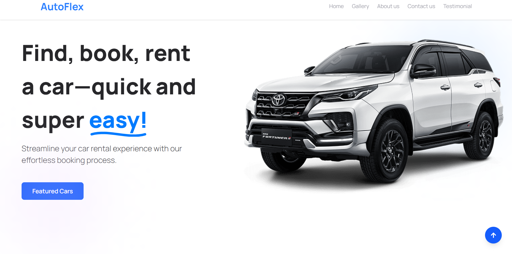

# 🚗 Autoflex - Car Rental UI

Welcome to Autoflex! A sleek, modern, and user-friendly interface for a car rental platform, designed to make finding, booking, and renting a car quick and easy.



## ✨ Features
- **Modern UI/UX:** A clean, responsive, and beautiful user interface built with the latest web technologies.
- **Fast & Performant:** Built with Vite for a blazing-fast development experience and optimized production builds.

## 🛠️ Built With

This project is built with a modern, performant, and scalable tech stack:

- **Vite:** Next-generation frontend tooling for a superior development experience.
- **React:** The library for web and native user interfaces.
- **Tailwind CSS:** A utility-first CSS framework for rapid UI development.
- **Lucide React:** Simply beautiful & consistent open-source icons.

## 🚀 Getting Started

To get a local copy up and running, follow these simple steps.

### Prerequisites

Make sure you have Node.js installed on your machine.

- Node.js (v18.x or higher recommended)
- npm, pnpm, or yarn

### Installation & Running

1.  Clone the repository to your local machine.
    ```sh
    git clone https://github.com/noeljr2306/autoflex.git
    ```
2.  Navigate to the project directory and install the dependencies.
    ```sh
    cd autoflex
    npm install
    ```
3.  Run the development server.
    ```sh
    npm run dev
    ```
4.  Open http://localhost:5173 (or the port shown in your terminal) to view it in the browser.
